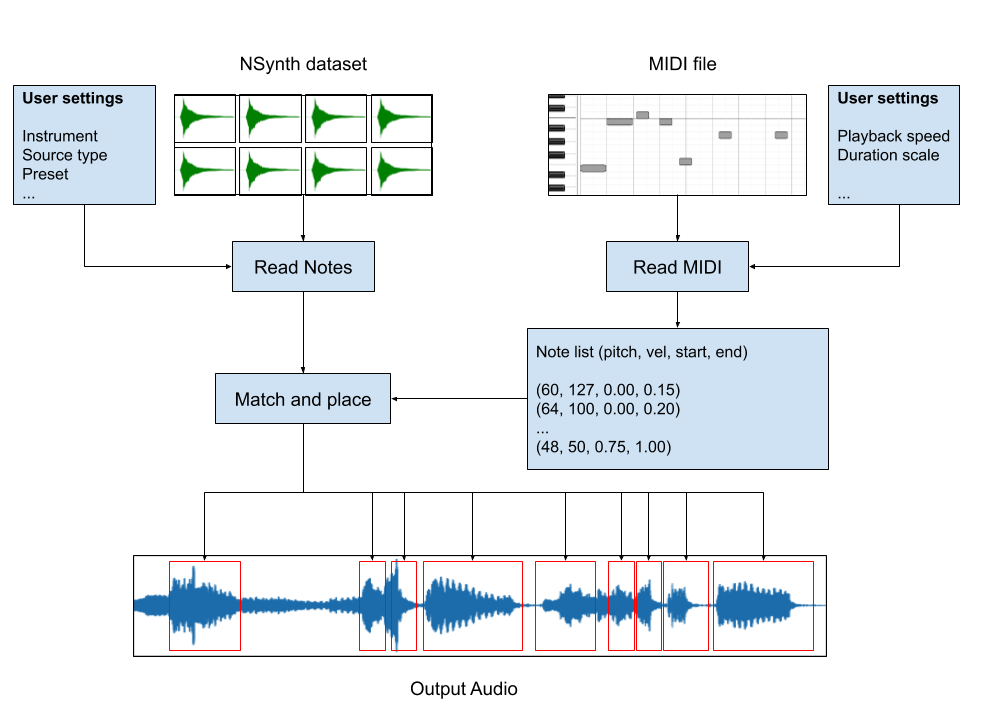

# NSynth-MIDI-Renderer

This Project is intended to provide a simple way to synthesize any MIDI sequence to an audio file using the notes of the NSynth dataset. It works by substituting each note in the sequence with the specified instrument, pitch and velocity for all the notes in the sequence. 



# Quick start
Clone this repository to your system.
```bash
$ git clone https://github.com/hmartelb/NSynth-MIDI-Renderer.git
```

To start synthesizing audios, you need to download the NSynth dataset and some MIDI files. Here are two useful links:

* The NSynth Dataset, “A large-scale and high-quality dataset of annotated musical notes.” https://magenta.tensorflow.org/datasets/nsynth

* Classical Music MIDI Dataset, Kaggle https://www.kaggle.com/soumikrakshit/classical-music-midi

Also, make sure that you have Python 3 installed in your system. Then open a new terminal in the master directory and install the dependencies from requirements.txt by executing this command:
```bash
$ pip install -r requirements.txt
```

# How to use it 
For the general use case, 3 parameters must be specified:
1)	The path to the NSynth Dataset (audios directory)
2)	The MIDI file (*.mid, *.midi) containing the sequence
3)	The output path and name for the audio (*.wav)

To run the program, execute the following command in your terminal:
```bash
$ python NoteSynthesizer.py --db <path_to_nsynth> --seq <midi_filename> --output <audio_filename>
```
Additionally, there are some optional parameters:

# Examples
The files in the /output folder have been generated using different instruments, with sr=44100, playback_speed=1 and duration_scale=4, leaving the rest of optional parameters as default. The files are named using the following convention:
```bash
<midi_name>_<instrument>_<source_type>_<preset>.wav
```

# Licence

```
MIT License
Copyright (c) 2019 Héctor Martel

Permission is hereby granted, free of charge, to any person obtaining a copy
of this software and associated documentation files (the "Software"), to deal
in the Software without restriction, including without limitation the rights
to use, copy, modify, merge, publish, distribute, sublicense, and/or sell
copies of the Software, and to permit persons to whom the Software is
furnished to do so, subject to the following conditions:

The above copyright notice and this permission notice shall be included in all
copies or substantial portions of the Software.

THE SOFTWARE IS PROVIDED "AS IS", WITHOUT WARRANTY OF ANY KIND, EXPRESS OR
IMPLIED, INCLUDING BUT NOT LIMITED TO THE WARRANTIES OF MERCHANTABILITY,
FITNESS FOR A PARTICULAR PURPOSE AND NONINFRINGEMENT. IN NO EVENT SHALL THE
AUTHORS OR COPYRIGHT HOLDERS BE LIABLE FOR ANY CLAIM, DAMAGES OR OTHER
LIABILITY, WHETHER IN AN ACTION OF CONTRACT, TORT OR OTHERWISE, ARISING FROM,
OUT OF OR IN CONNECTION WITH THE SOFTWARE OR THE USE OR OTHER DEALINGS IN THE
SOFTWARE.
```
